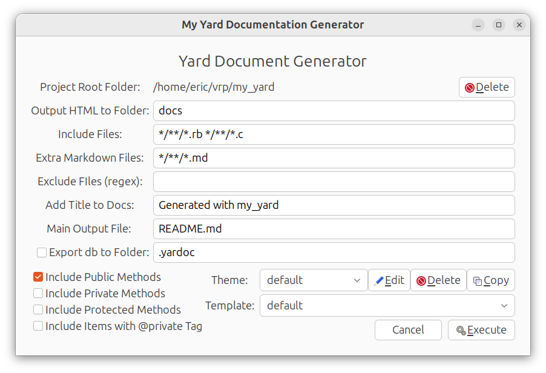

# My Yard Document Generator

To install:
```
gem install my_yard
```
That's it!

Then go to the directory that you want to document, and enter:
```
my_yard
```
You'll get this GUI:



You can choose your own fonts and colors to create great looking documents.
 Here's an example of a website that was generated using **my_yard**:

[Visual Ruby Home Page](https://beagle123.github.io/visualruby/)

This website was created by simply selecting
the **"visualruby"** theme.  But you are free to create your own themes and templates.
